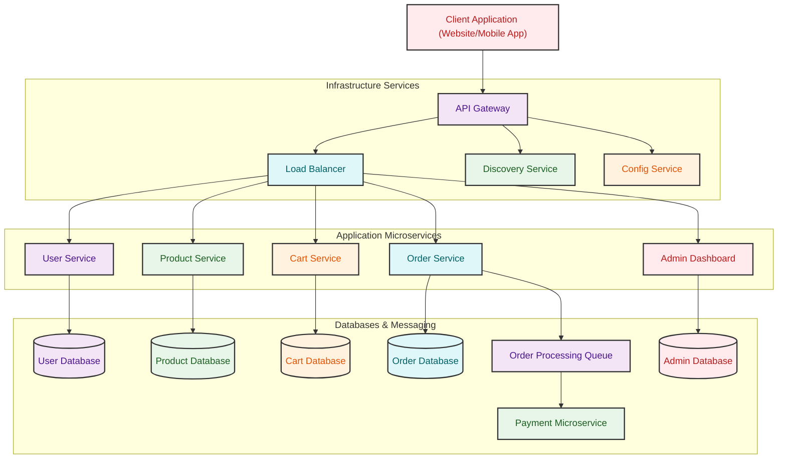

# E-Commerce Platform

# Table of Contents
1.  [Overview](#1-overview)
2.  [Features](#2-features)
3.  [Technologies Used](#3-technologies-used)
4.  [Architecture Diagram](#4-architecture-diagram)
5.  [Module Overview](#5-module-overview)
    * [Product Management Module](#product-management-module)
    * [Shopping Cart Module](#shopping-cart-module)
    * [Order Management Module](#order-management-module)
    * [User Authentication and Profile Management Module](#user-authentication-and-profile-management-module)
    * [Admin Dashboard Module](#admin-dashboard-module)
    * [API Gateway](#api-gateway)
    * [Discovery Server(Eureka)](#discovery-servereureka)
6.  [Deployment Strategy](#6-deployment-strategy)
    * [Local Deployment](#local-deployment)
7.  [Database Design](#7-database-design)
    * [Tables and Relationships](#tables-and-relationships)
8.  [User Interface Design](#8-user-interface-design)
    * [Wireframes](#wireframes)
9.  [Module Setup Instructions](#9-module-setup-instructions)
    * [Frontend (React)](#frontend-react)
    * [Backend (Spring Boot)](#backend-spring-boot)
    * [Database](#database)
10. [Testing](#10-testing)
    * [Unit Testing](#unit-testing)

---

## 1. Overview
This E-Commerce Platform allows users to browse products, manage shopping carts, make payments, and track orders. It includes an admin interface for managing products, orders, users, and analytics. The platform supports Java (Spring Boot) for backend development and React for frontend development.

## 2. Features
- **Product Management**: Create, update, delete, and categorize products.
- **Shopping Cart**: Add, remove, and manage items in the shopping cart.
- **Order Management**: Process customer orders and manage payments.
- **User Authentication and Profile Management**: User registration, login, profile updates, and password management.
- **Admin Dashboard**: Manage users, products, and view analytics on sales and user activity.

## 3. Technologies Used
- **Frontend**: React
- **Backend**: Java (Spring Boot)
- **Database**: MySQL
- **Architecture**: REST API-based architecture

## 4. Architecture Diagram


## 5. Module Overview

### [Product Management Module](https://github.com/Santhoshram7077/E-Commerce/blob/main/README.md)
- **Features**: Manage product listings, including creation, updates, and categorization.
- **Entities**: Product (ProductID, Name, Description, Price, Category, ImageURL)

### Shopping Cart Module
- **Features**: Add/remove products to/from the shopping cart, view items and total price.
- **Entities**: CartItem (CartItemID, ProductID, Quantity, TotalPrice)

### Order Management Module
- **Features**: Place orders with shipping details, payment processing.
- **Entities**: Order (OrderID, UserID, TotalPrice, ShippingAddress, OrderStatus, PaymentStatus)

### User Authentication and Profile Management Module
- **Features**: User registration and login functionality, profile updates.
- **Entities**: User (UserID, Name, Email, Password, ShippingAddress, PaymentDetails)

### Admin Dashboard Module
- **Features**: Manage products, view order statuses, customer details, generate sales analytics and reports.
- **Entities**: Admin (AdminID, Name, Role, Permissions)

### API Gateway
- Provides a unified entry point to route incoming client requests to appropriate microservices.
- Also handles load balancing, logging, and cross-cutting concerns.

### Discovey Server(Eureka)
- Acts as a service registry where all microservices register themselves.
- Enables dynamic service discovery and communication within the ecosystem. 

## 6. Deployment Strategy
### Local Deployment
- **Frontend**: Served using local servers (e.g., `npm start` for React).
- **Backend**: Deployed locally using Spring Boot.
- **Database**: Local instance of MySQL for testing.

## 7. Database Design
### Tables and Relationships
- **Product**: Primary Key: ProductID
- **User**: Primary Key: UserID
- **CartItem**: Primary Key: CartItemID, Foreign Key: ProductID
- **Order**: Primary Key: OrderID, Foreign Key: UserID
- **Admin**: Primary Key: AdminID

## 8. User Interface Design
### Wireframes
- Product Listing Page
- Shopping Cart Page
- Order Confirmation Page
- User Profile Management Page
- Admin Dashboard

## 9. Module Setup Instructions
### Frontend (React)
1. **Install Dependencies**:
    ```bash
    npm install
    ```
2. **Start Development Server**:
    ```bash
    npm start
    ```

### Backend (Spring Boot)
1. **Build Project**:
    ```bash
    mvn clean install
    ```
2. **Run Application**:
    ```bash
    mvn spring-boot:run
    ```

### Database
1. **Setup Database**:
    - Create a MySQL database instance.
    - Configure database connection settings in the backend application properties.

## 10. Testing
### Unit Testing
- **Frontend**: Use Jest and React Testing Library.
    ```bash
    npm test
    ```
- **Backend**: Use JUnit and Mockito.
    ```bash
    mvn test
    ```

